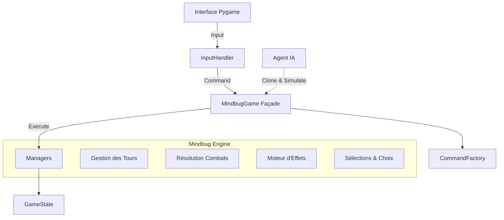

# 👾 Mindbug Engine & GUI (Python)

Un moteur de règles complet, robuste et testé pour le jeu de cartes Mindbug (Set First Contact). Ce projet implémente une logique métier (Backend) découplée et une interface graphique (Frontend) basée sur Pygame.

## ✨ Fonctionnalités Clés

### 🧠 Moteur de Jeu (Engine)

- **Respect total des règles Mindbug :** Gestion de la phase de Mindbug, du Replay et de la résolution des combats.
- **Système de Mots-Clés :** Implémentation complète de *FRENZY* (Fureur), *TOUGH* (Tenace), *POISON* (Venimeux), *SNEAKY* (Furtif) et *HUNTER* (Chasseur).
- **Architecture Modulaire (V3) :** Utilisation du *Command Pattern* pour séparer l'intention de l'exécution.
- **Moteur d'Effets Data-Driven :** Les cartes sont définies en JSON. Support des triggers complexes (`ON_PLAY`, `ON_DEATH`, `PASSIVE`, etc.).
- **Performance :** Optimisation via `Pickle` pour permettre des simulations IA rapides.

### 🎮 Interface Graphique (GUI)

- **Menu Principal & Paramètres :** Gestion de la résolution, plein écran et sets actifs.
- **Mode Jeu Local (Hotseat) :** Jouez à deux sur le même écran avec un système de "rideau" pour cacher les mains.
- **Mode Solo (PvE) :** Affrontez une IA avec différents niveaux de difficulté.
- **Construction de Deck :** Outil pour visualiser, bannir ou forcer certaines cartes dans le tirage.

## 🏗️ Architecture Technique

Le projet suit une architecture stricte pour faciliter la maintenance et l'évolution.



## 🚀 Installation & Utilisation

### Prérequis

- Python 3.10 ou supérieur

### Installation

```bash
git clone https://github.com/HelloIAmRomain/Mindbug-AI.git
cd mindbug-engine
pip install -r requirements.txt
```

### Lancer le jeu

```bash
python3 main.py
```

### Lancer les tests

Le projet est couvert par une suite de tests exhaustive (Unitaires & Intégration).

```bash
pytest
```

## 🃏 Gestion des Données (JSON)

Les cartes sont définies dans `data/cards.json`. Le moteur est agnostique : il suffit de modifier ce fichier pour ajouter de nouvelles cartes ou modifier l'équilibrage sans toucher au code Python.

## 🗺️ Roadmap & Améliorations Futures

## ⚠️ Liste bugs

- Défense avec une furie : la carte défenseuse ne doit pas attaquer 2 fois
- Crapaud bombe :
  - --> Ne tue pas coriace si elle a ses 2 PV.
  - --> L'effet doit pouvoir se faire sur une carte alliée
  - --> A vérifier si l'effet est obligatoire (ex : pas d'adversaire, dois-je sacrifier un allié?)
- requin toutou : hunter ne fonctionne pas

### 🎨 Interface & Expérience Utilisateur (UX)

- [X] **Drag & Drop :** Remplacer le système de clics par un glisser-déposer fluide des cartes.
- [ ] **Plateau Immersif :** Design graphique amélioré (tapis de jeu, zones distinctes).
- [ ] **Feedback Visuel :** Animations pour les attaques, les dégâts et l'utilisation des Mindbugs.
- [ ] **Audio :** Ajout de bruitages et d'une musique d'ambiance dynamique.

### 🧠 Intelligence Artificielle (IA)

- [X] **IA "Puissante" (MCTS) :** Implémentation de Monte Carlo Tree Search pour une prise de décision stratégique profonde.
- [ ] **Conseiller Stratégique (Stat Advisor) :** Un assistant en jeu qui utilise l'IA pour analyser votre situation, évaluer vos chances de victoire et suggérer le meilleur coup (idéal pour apprendre).

### ⚙️ Moteur & Contenu

- [ ] **Extension "New Servants" :** Ajout des nouvelles mécaniques (Evolve, Banish) et cartes de l'extension.
- [ ] **Mode Multijoueur en Ligne :** Architecture Client/Serveur pour jouer à distance.
- [ ] **Export de Replay :** Sauvegarder et revoir ses parties pour les analyser.

## 📄 Licence

Ce projet est un moteur open-source développé à des fins éducatives et passionnées. Mindbug est une marque déposée de Nerdlab Games. Ce projet n'est pas affilié officiellement.
