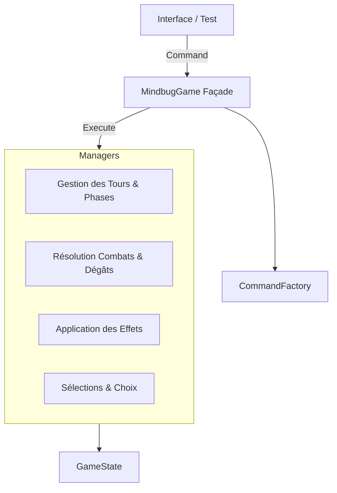

# 👾 Mindbug Engine (Python)

Un moteur de règles complet, robuste et testé pour le jeu de cartes Mindbug (Set First Contact). Ce projet implémente la logique métier (Backend/Engine) sans interface graphique, en se concentrant sur le respect strict des règles, la gestion des états et l'architecture logicielle.

## ✨ Fonctionnalités Clés

### Respect total des règles Mindbug

- Gestion de la phase de Mindbug (Vol de carte)
- Mécanique de Replay (si une carte est volée, le joueur rejoue)
- Résolution complète des combats (mathématiques et effets)

### Système de Mots-Clés (Keywords)

Implémentation de FRENZY (Fureur), TOUGH (Tenace), POISON (Venimeux), SNEAKY (Furtif), HUNTER (Chasseur).

### Moteur d'Effets Data-Driven

- Les cartes sont définies dans un fichier JSON
- Support des triggers : `ON_PLAY`, `ON_ATTACK`, `ON_DEATH`, `ON_UNBLOCKED`, `PASSIVE` (Auras)
- Effets complexes : Vol (Main/Board), Défausse, Buffs conditionnels, Copie de mots-clés

### Architecture V3 (Command Pattern)

- Séparation nette entre la demande d'action (Command) et son exécution
- Système d'interruption pour les choix utilisateurs (`RESOLUTION_CHOICE`)

## 🏗️ Architecture Technique

Le projet est structuré autour d'une architecture modulaire pour faciliter la maintenance et les tests.



### Dossiers Principaux

- `mindbug_engine/core/` : Modèles de données (Card, Player, GameState)
- `mindbug_engine/commands/` : Implémentation du pattern Command (PlayCard, Attack, Mindbug...)
- `mindbug_engine/managers/` : Logique métier divisée par responsabilité
- `data/` : Contient `cards.json` (la base de données des cartes)

## 🚀 Installation & Utilisation

### Prérequis

- Python 3.10 ou supérieur
- pytest (pour les tests)

### Installation

```bash
git clone https://github.com/HelloIAmRomain/Mindbug-AI.git
cd mindbug-engine
pip install -r requirements.txt
```

### Utilisation

```bash
python3 main.py
```

## 🧪 Tests & Qualité

Le moteur est validé par une suite de tests exhaustive couvrant 100% des cartes du set de base.

### Lancer les tests

```bash
pytest
```

### Structure des tests

- `tests/unit/` : Tests isolés des managers (Effets, Combat)
- `tests/integration/` :
  - `test_engine_flow.py` : Vérifie le déroulement des tours, le Mindbug et le Replay
  - `test_triggers.py` : Vérifie les interruptions (ex: Trigger sur mort)
  - `test_full_set.py` : 32 tests vérifiant chaque carte spécifique du jeu (Dr. Axolotl, Kangousaurus Rex, etc.)

## 🃏 Gestion des Données (JSON)

Les cartes sont définies dans `data/cards.json`. Le moteur est agnostique : il suffit de modifier ce fichier pour ajouter de nouvelles cartes ou modifier l'équilibrage.

### Exemple de définition (Furet Saboteur)

```json
{
  "id": "09",
  "name": "Furet saboteur",
  "power": 2,
  "keywords": ["SNEAKY"],
  "trigger": "ON_PLAY",
  "effects": [
    {
      "type": "DISCARD",
      "target": {
        "group": "OPPONENT",
        "zone": "HAND",
        "count": 2,
        "select": "CHOICE_OPP"
      }
    }
  ]
}
```

## 📋 Roadmap & Améliorations futures

- [x] Set "First Contact" complet
- [x] Moteur de résolution (Combat, Effets, Mindbug)
- [x] Tests d'intégration complets
- [ ] Ajout du support pour l'extension "New Servants"
- [ ] Ajout d'une IA surpuissante (le code existe mais l'ia est NULLE)


## 📄 Licence

Ce projet est un moteur open-source développé à des fins éducatives.

